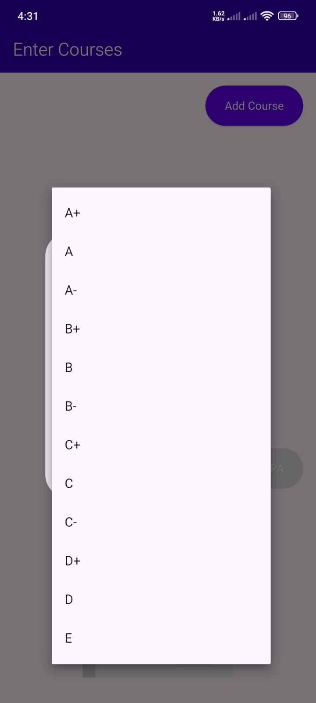

# 📊 GPA Calculator

A cross-platform GPA Calculator built with Flutter, supporting Android, iOS, Web, Windows, macOS, and Linux.

---

## ✨ Features

- 📐 **GPA Calculation** — Calculate semester and cumulative GPA instantly
- ➕ **Add / Edit / Delete Courses** — Manage your course list with ease
- 🔢 **Multiple Grading Scales** — Supports 4.0, 5.0 grading systems
- 📱 **Cross-Platform** — Runs on Android, iOS, Web, Windows, macOS, and Linux
- 🌙 **Clean UI** — Minimal and intuitive interface
- 💾 **Local Storage** — Saves your data between sessions

---

## 📸 Screenshots
| Home Screen | Add Course | GPA Result |
|-------------|------------|------------|
|  |  |  
 | |  |
 |

---

## 🚀 Getting Started

### Prerequisites

Make sure you have the following installed:

- [Flutter SDK](https://flutter.dev/docs/get-started/install) (>= 3.0.0)
- [Dart SDK](https://dart.dev/get-dart) (>= 3.0.0)
- [Android Studio](https://developer.android.com/studio) or [VS Code](https://code.visualstudio.com/)
- A connected device or emulator

### Installation

1. **Clone the repository**

   ```bash
   git clone https://github.com/ChamikaCc/gpa-calculator.git
   cd gpa-calculator
   ```

2. **Install dependencies**

   ```bash
   flutter pub get
   ```

3. **Run the app**

   ```bash
   flutter run
   ```

---

## 🏗️ Project Structure

```
gpa-calculator/
├── android/          # Android platform files
├── ios/              # iOS platform files
├── linux/            # Linux platform files
├── macos/            # macOS platform files
├── web/              # Web platform files
├── windows/          # Windows platform files
├── lib/              # Dart source code
│   ├── models/       # Data models (Course, Semester, etc.)
│   ├── screens/      # UI screens
│   ├── widgets/      # Reusable widgets
│   ├── utils/        # Helper functions & GPA logic
│   └── main.dart     # App entry point
├── assets/           # Images, fonts, and other assets
├── doc/api/          # API documentation
├── test/             # Unit and widget tests
├── pubspec.yaml      # Project configuration & dependencies
└── README.md
```

---

## 🧮 GPA Calculation Logic

The GPA is calculated using the standard weighted average formula:

```
GPA = Σ (Grade Points × Credit Hours) / Σ (Credit Hours)
```

**Grade Scale (4.0 System):**

| Grade | Points |
|-------|--------|
| A+    | 4.0    |
| A     | 4.0    |
| A-    | 3.7    |
| B+    | 3.3    |
| B     | 3.0    |
| B-    | 2.7    |
| C+    | 2.3    |
| C     | 2.0    |
| D     | 1.0    |
| F     | 0.0    |

---

## 🛠️ Built With

- [Flutter](https://flutter.dev/) — UI framework
- [Dart](https://dart.dev/) — Programming language
- [Provider](https://pub.dev/packages/provider) / [Riverpod](https://pub.dev/packages/flutter_riverpod) — State management _(update as applicable)_
- [shared_preferences](https://pub.dev/packages/shared_preferences) — Local data persistence

---

## 🧪 Running Tests

```bash
flutter test
```

---

## 📦 Building for Release

**Android APK:**
```bash
flutter build apk --release
```

**iOS:**
```bash
flutter build ios --release
```

**Web:**
```bash
flutter build web
```

**Windows:**
```bash
flutter build windows
```

---

## 📄 API Documentation

Auto-generated Dart documentation is available in the [`doc/api`](doc/api/) folder.

To regenerate the docs:

```bash
dart doc .
```

---

## 🤝 Contributing

Contributions are welcome! Please follow these steps:

1. Fork the repository
2. Create a feature branch (`git checkout -b feature/your-feature`)
3. Commit your changes (`git commit -m 'Add your feature'`)
4. Push to the branch (`git push origin feature/your-feature`)
5. Open a Pull Request

---

## 📝 License

This project is licensed under the MIT License — see the [LICENSE](LICENSE) file for details.

---

## 👤 Author

**ChamikaCc**  
GitHub: [@ChamikaCc](https://github.com/ChamikaCc)

---

> ⭐ If you found this project helpful, please give it a star!
